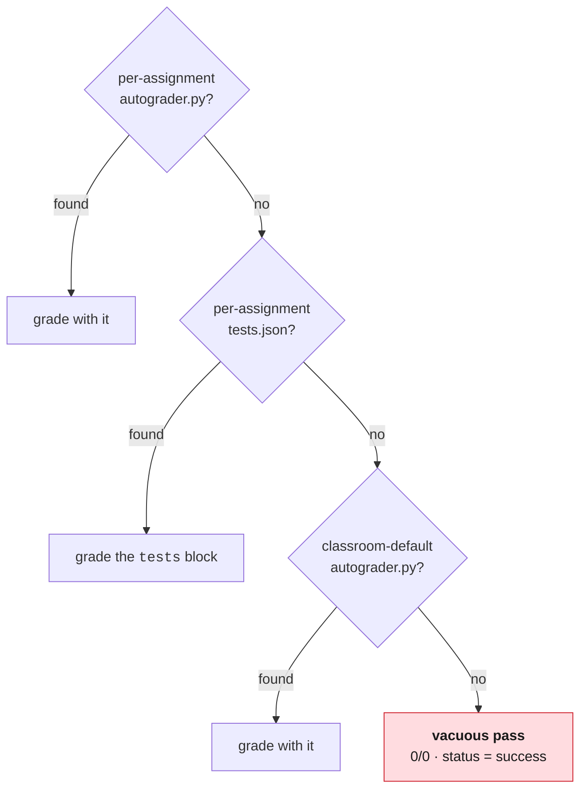

# Troubleshooting

Symptom first. Each entry says how to confirm the diagnosis, not just what to
try.

---

## Everything passes, including work that should fail

**The one to know about.** Every submission comes back green with score `0/0`,
including an empty repo.

**Cause.** No grading is configured. `runner.py` resolves an entrypoint
most-specific-first:



> [!CAUTION]
> That last step is **not an error**. It is a deliberate "no autograder
> configured yet" state so the gradebook still ingests submissions during setup.
> It renders green everywhere.

**Confirm it:**

```sh
gh teacher assignment test list <org> <classroom> <slug>
```

Empty output means no tests. Also check the score itself: `0/0` is the
signature. A real pass has a real denominator.

**Fix.** Add a `tests` block ([Writing tests](writing-tests.md)), or drop an
`autograder.py` at `<classroom>/autograders/<slug>/`.

**Then re-verify by breaking something on purpose.** A green run cannot
distinguish "correct" from "ungraded". Only a red run proves grading is live.

> [!NOTE]
> Not hypothetical. This is exactly how a broken autograder shipped in August
> 2026: the assignment pointed at a template containing only a README, and
> carried no `tests` block. Every push came back green and nothing anywhere
> said otherwise.

---

## I added tests but grading didn't change

**Cause.** The `tests` block didn't survive publication.

**Confirm it.** Check the Publish Pages run for the materializer line:

```sh
gh run list -R <org>/classroom50 -w "Publish Pages" -L 1
gh run view <run-id> -R <org>/classroom50 --log | grep materialized
```

You want `materialized .../tests.json (N test(s))` with **N > 0**. Zero, or a
silent step, means the block didn't parse.

Then confirm the bundle is actually being served:

```sh
curl -sI https://<org>.github.io/classroom50/<classroom>/autograders/<slug>.tar.gz
```

`200` is good. `404` means it never published, so check that Pages is enabled
and the workflow finished.

---

## Students see twelve failures from one mistake

**Cause.** A broken import or syntax error. pytest can't collect, reports zero
cases, and the runner falls back to all-or-nothing exit-code scoring.

**Fix.** Add a cheap `run` test ahead of the suite:

```sh
gh teacher assignment test add <org> <classroom> <slug> \
    --name "module imports" --type run \
    --run 'python3 -c "import src.yourmodule"' --points 1
```

It doesn't change the score much. It changes the *message* from twelve confusing
errors to "your module doesn't import."

---

## A correct-looking program fails an `io` test

**Cause.** Almost always `--comparison exact` against output with a prompt,
trailing newline, or stray whitespace.

**Confirm it.** Read the diff in the feedback. If the only difference is
leading/trailing text, that's this.

**Fix.** Switch to `included`:

```sh
gh teacher assignment test remove <org> <classroom> <slug> "<test name>"
gh teacher assignment test add ... --comparison included ...
```

Use `exact` only when output formatting is itself being graded, and say so in
the assignment text.

---

## Tests time out

**Cause.** The default timeout is **10 seconds**, and it covers `--setup`. Any
test doing `pip install` will blow through it.

**Fix.** `--timeout 120`. Range is 1–600.

Worth fixing promptly: a timeout is reported as a failure, so students read it
as "my code is wrong."

---

## Score collection fails with a permissions error

**Cause.** The service token's **resource owner** is your personal account
rather than the organization. A personal-owned token cannot see org repos.

**Fix.** Regenerate the fine-grained PAT with the **organization** selected as
resource owner, then re-run `gh teacher init <org>` to upload it.

```sh
gh workflow run "Collect Scores" -R <org>/classroom50
gh run list -R <org>/classroom50 -w "Collect Scores" -L 1
```

---

## `gh teacher assignment add` rejects my template

**Causes, in order of likelihood:**

1. **Not flagged as a template.** Settings → Template repository → ✓.
2. **Private and outside the org.** Public always works; private works only
   inside your organization. Move it in or make it public.
3. **Slug malformed.** Must match `^[a-z0-9][a-z0-9-]{1,38}$`.

---

## A student's repo has no Actions runs

**Causes:**

1. **The assignment is in `tag` submission mode and they just pushed.** In that
   mode only `submit/*` tags grade, by design, so a plain `git push` does
   nothing. Students submit with `gh student submit`. Check with
   `gh teacher assignment list <org> <classroom> --json`, and switch the whole
   assignment if it was unintended:

   ```sh
   gh teacher assignment submission-mode <org> <classroom> <slug> every-push
   ```

   That retrofits existing student repos, not just new ones.
2. They pushed to a non-default branch. The grading workflow triggers on the
   default branch.
3. They accepted before you added the `tests` block, so their repo has the shim
   but nothing to grade. Have them push again; the runner fetches config at
   grade time, so a new push picks it up without re-accepting.
4. Actions are disabled org-wide. `gh teacher init` enables them; re-run it.

---

## The template repo's own CI is red

> [!NOTE]
> **Expected, if you configured it the obvious way.** The starter is
> unimplemented, so running the full suite against it fails.

This repository handles it with two modes keyed on the repo's `is_template`
flag: a template asserts its suite **collects**, a student copy
runs the **full suite**. Copy that pattern rather than deleting the workflow. A
template with no CI can't catch a broken import before thirty students hit it.

---

## Still stuck

- Commands and flags: [`gh teacher` wiki](https://github.com/foundation50/classroom50/wiki/CLI-Teacher-Guide)
- Grading internals: [Autograders wiki](https://github.com/foundation50/classroom50/wiki/Autograders)
- Schemas: [`foundation50/classroom50/schemas`](https://github.com/foundation50/classroom50/tree/main/schemas)
- The runner itself: `.github/scripts/runner.py` in your organization's
  `classroom50` config repo. The docstrings are accurate and worth reading when
  behavior surprises you.
